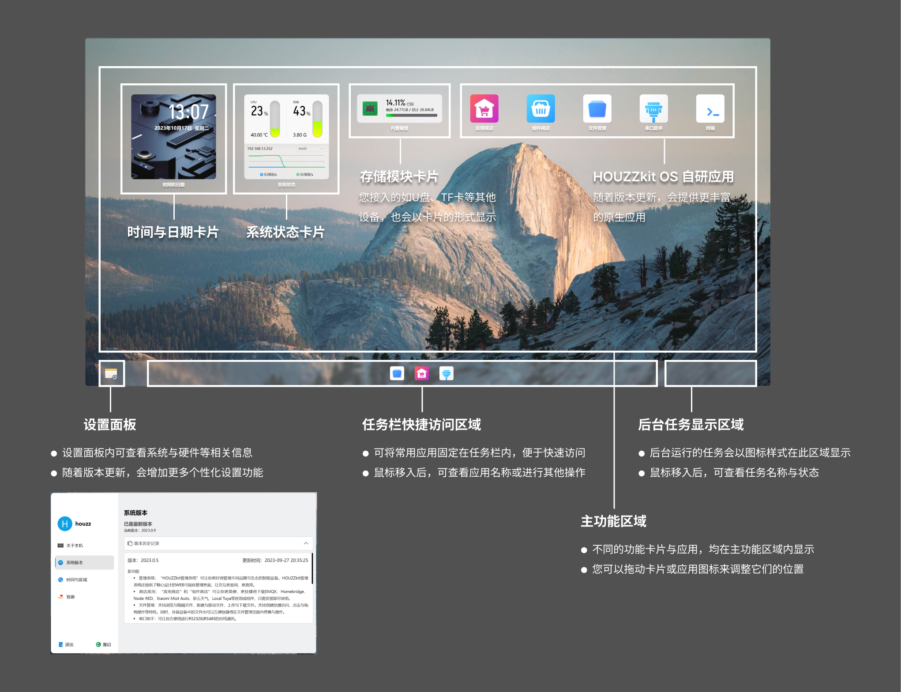
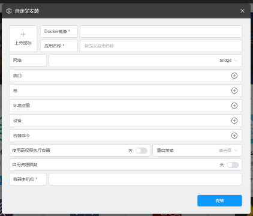
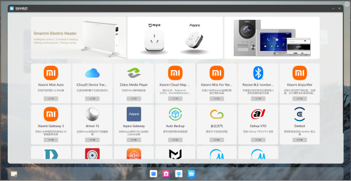

---
# 这是文章的标题
title: HOUZZkit 功能文档
# 这是页面的图标
icon: file
# 这是侧边栏的顺序
order: 1
# 设置作者
author: Yin Baiyuan
# 设置写作时间
date: 2023-10-13
# 一个页面可以有多个分类
category:
  - 使用指南
# 一个页面可以有多个标签
tag:
  - 页面配置
  - 使用指南
# 此页面会在文章列表置顶
sticky: true
# 此页面会出现在文章收藏中
star: true
---

## 主页功能区说明

##  应用商店使用说明
### 直接安装应用
应用商店内提供了各种扩展智能家居功能、、媒体影音、数据监测等不用类型的软件，您可以根据自己的喜好和需求选择合适的软件，增加智能家居的趣味性和实用性。
应用商店内会持续增加新的应用，以满足大家不同的使用场景和需求。

### 自定义安装应用
您还可以根据自己的需要，在应用商店内点击“自定义安装”，自行安装其他 Docker 应用。

##  组件商店使用说明

在组件商店内安装的组件，均可在 Home Assistant 中直接安装并进行相关配置，而无需使用GitHub账号或其他限制。具体步骤如下：

1. 在应用商店内安装 Home Assistant 应用，安装完成后打开 Home Assistant 应用，注册后登录，或直接登录；
2. 在组件商店内安装组件；
3. 安装完成后，回到 Home Assistant 页面，并进行重启；
4. 重启后，点击 “配置——设备与服务——添加集成”，查找并安装相应组件；
5. 安装完成后，进行配置使用即可。

- [Markdown 展示](markdown.md)

- [页面展示](page.md)

- [禁用展示](disable.md)

- [加密展示](encrypt.md)

- [测试页面](mydoc.md)
